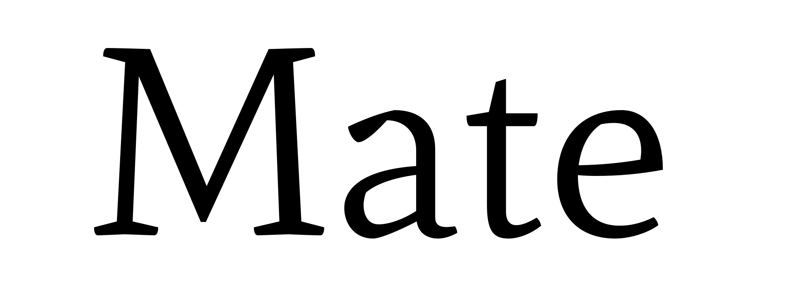
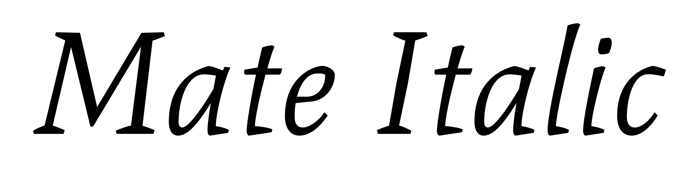
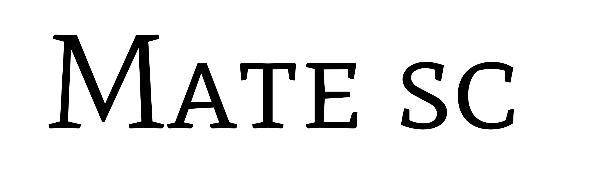

### Mate

Simple in its structure; sharp and generous counter-shapes which create a medium texture that calls for good page color, in addition to offering a more relaxed reading experience for each line of text: Mate.

The italics that accompany the regular style show their quality in the shading of strokes, in the counters and the unusual shapes for this style as well as the calligraphic reminiscences that give this style a different and pleasant visual rhythm.

The Small Caps (SC) style, featuring traditional proportions, completes this initial release with its medium height numbers in all styles.

The primary use for the family is in text, yet due to the constructive details of letterforms, this family can be used in larger sizes for display typography.

### Designer

* Eduardo Rodríguez Tunni

### License

Licensed under the [*SIL Open Font License, 1.1*](http://scripts.sil.org/OFL); you may not use this file except in compliance with the License.

To contribute to the project contact Eduardo Rodríguez Tunni > edu@tipo.net.ar
